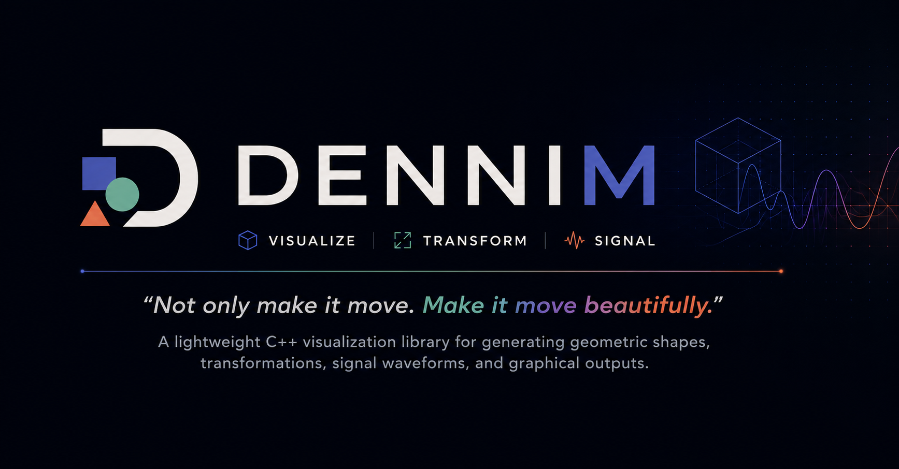
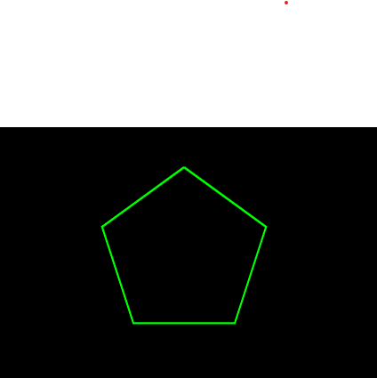
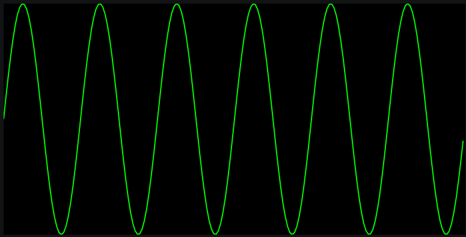

A lightweight C++ visualization library for generating geometric shapes, transformations, signal waveforms, and graphical outputs across desktop and embedded platforms.

## Overview

DenniM:: provides a common API for:

* Creating geometric shapes
* Generating mathematical and signal waveforms
* Applying transformations such as rotation, translation, and scaling
* Rendering outputs to SVG files on desktop systems
* Rendering graphs and shapes on TFT displays using ESP32 and Arduino

The project is divided into two implementations:

### Desktop Library (`cppviz`)

Designed for standard C++ applications and SVG generation.

### Arduino Library (`cppviz-arduino`)           (yet to be implemented)

Designed for microcontrollers and TFT displays using Arduino-compatible boards such as ESP32.

---

## Project Structure

```text
project/

├── cppviz/
│   ├── core/
│   ├── shapes/
│   ├── renderers/
│   └── examples/
│
└── cppviz-arduino/
    ├── src/
    │   ├── core/
    │   ├── shapes/
    │   └── renderers/
    ├── examples/
    └── library.properties
```

---

## Features

### Shapes

* Line
* Rectangle
* Triangle
* Circle
* Polygon




### Transformations

* Rotation
* Translation
* Scaling

### Signal Generation

* Sine Wave
* Cosine Wave
* Square Wave     (yet to be implement)
* Triangle Wave   (yet to be implement)
* Sawtooth Wave   (yet to be implement)

### Rendering

Desktop:

* SVG file export

Embedded:

* TFT display rendering   (yet to be implement)
* ESP32 compatible        (yet to be implement)
* Arduino IDE compatible  (yet to be implement)

---

## Example

```cpp
#include "../core/Coordinate.h"
#include "../shapes/Shapes.h"
#include "../shapes/Signals.h"
#include "../renderers/SVGRenderer.h"


using namespace cppviz;

int main() {
    SignalDataResult sig = signal.SineSignal(
                                2.0f,       // time
                                200,        // samples
                                3.0f        // frequency
);
        renderer.renderSignal(sig, "signal.svg");
        std::cout << "[OK] signal.svg\n";

    return 0;
}
```

---

## Building Desktop Version

```bash
g++ -std=c++17 -I. examples/desktop_sine.cpp -o demo
./demo
```

Generated SVG files will be written to the working directory.

---

## Roadmap

* PNG renderer
* Real-time plotting
* Additional waveform generators
* Animation support                  (yet to be implement)
* 3D geometry support                (yet to be implement)
* Multiple display driver backends   (yet to be implement)

---

## License

MIT License

---

## Author

Vinayak Dwivedi
